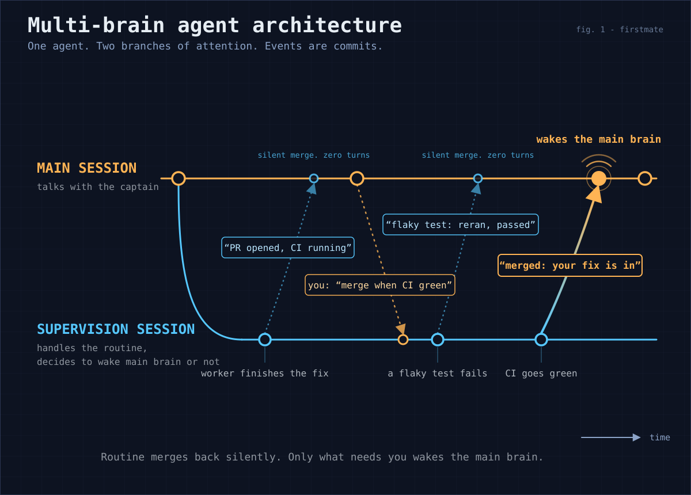

# Pi supervision branch

The poster is the visual of the idea.
This document stays the owner and the contract.

Fleet supervision on the Pi primary harness can run on a second, persistent conversation - the supervision branch - inside the same `pi` process as the captain's chat.
The branch is enabled only by exact `project=` entries in `config/pi-supervision-branch`, and it handles an ordinary actionable wake only when the eligible task-local rows resolve to one granted project.
Ordinary main-only rows remain on main even when granted task-local rows share their queue, while ungranted, mixed-project, fleet-wide, malformed, or unresolvable wakes stay entirely on main.
Every watcher-failure alarm also stays on main.
Only captain-relevant branch outcomes open a turn on main - that follow-up turn is itself the captain-visible outcome, so Pi never separately prints or renders a captain-facing merge note.
The design source is the captain-approved forked-supervision architecture board, a captain-private fleet record (a self-contained HTML explainer with the measured cache and judgment evidence); this document records the shape it landed as, and the delivering PR cites the board artifact itself.

This feature is Pi-only by construction and changes nothing anywhere else:

- The branch lives in `.pi/extensions/fm-branch-supervision.ts`, which only a Pi primary ever loads; no other harness gains or loses behavior.
- The bash-side additions (leases, the outcome store, session-start recovery) are inert in a home that never runs the branch: no lease files exist, no actor variable is set, every guard passes silently, and no new state appears (`tests/fm-branch-supervision.test.sh` holds this).
- It does not change which harness is primary and never moves a home to Pi.

## Components and their owners

- Wake dispatch: `.pi/extensions/fm-primary-pi-watch.ts` stays the dispatcher; `.pi/extensions/lib/fm-branch-dispatch.ts` owns the offer handshake and row eligibility, while [`watcher-continuity.md`](watcher-continuity.md#per-actor-acknowledgement) owns the per-actor consume contract.
  A successful row grant transfers ownership of exactly the currently eligible rows for one granted project to the branch; a check-kind triggering close (merge-confirmation polls, Relay mentions, credential/auth failures, and every other legitimately main-only class) is never offered even when other rows are eligible, no acceptor (extension absent, ungranted project, away mode, branch broken) keeps today's wake-to-main path for that close, and watcher-failure alarms always go to main because only main can repair the watcher cycle.
- The branch itself: `.pi/extensions/fm-branch-supervision.ts` creates and reopens the persistent branch session, serializes wakes, mirrors dialog, and merges outcomes.
  It checks the current extension generation and `state/.lock` ownership before each guarded branch side effect so replacement or lock loss cannot let an old continuation mutate the new session.
  Every path that cannot reach a working branch falls back to delivering the wake to main - a broken branch degrades to today's behavior, never to a lost wake.
- Branch system prompt: `bin/fm-branch-prompt.sh`; its header owns the byte-stable-prefix contract (no timestamps, no fleet snapshot, no per-wake content).
- Outcome store: `bin/fm-branch-outcome.sh`; its header owns the append-only format and the read cursor.
  Outcomes are written to the store before any note is handed to Pi, and rows that never reach that handoff replay once through the next locked session-start digest.
- Consistency: `bin/fm-lease-lib.sh` owns the per-task lease contract, the main-only role partition, and the deliberate CONFUSED-AGENT-GRADE threat model these guards target (captain-decided; adversarial-grade separation is out of scope and tracked as follow-up design work); `bin/fm-lease.sh` is the command surface.
  The guards are wired into `fm-send.sh`, `fm-control.sh`, and `fm-teardown.sh` (overlap, lease-checked, with claim serialization retained through the mutation) and `fm-pr-merge.sh`, `fm-merge-local.sh`, and `fm-spawn.sh` (main-owned, branch refused; a relaunch through `fm-control` stays branch-legal recovery).
- Autonomy: `config/pi-supervision-branch` is the captain's explicit project grant (docs/configuration.md "Pi supervision branch").
  The branch accepts only ordinary actionable wakes whose eligible rows resolve to exactly one listed project; absent or malformed grants, mixed-project rows, fleet-wide wakes, unresolvable rows, and every watcher-failure alarm stay on main.
  The branch recomputes eligibility immediately before prompting the branch to drain and publishes the exact eligible row set to `state/.branch-eligible-rows` through `writeEligibleRowsSnapshot`.
  It also re-reads the grant at that boundary, so a changed, ungranted, or mixed-project scope returns to main before any row claim.
  A newly-arrived main-owned row observed at that recheck is excluded from the eligible set, so the granted project rows can still reach the branch and the main-owned row stays queued for main's own later drain.
  [`watcher-continuity.md`](watcher-continuity.md#per-actor-acknowledgement) owns the consume-side guarantee that neither actor can present or acknowledge the other's claim.
  A producer can still append a row in the instant between that final check and drain startup; this accepted residual follows the confused-agent-grade boundary above rather than claiming adversarial queue isolation.
  Away mode and a broken branch keep today's wake-to-main behavior.

## How the branch knows what the captain said

Main's captain and assistant text - never tool calls, tool results, operational injections, or the branch's own merged notes - is mirrored into the branch as read-only `fm-main-mirror` messages at main's turn end, before the next wake is handed over.
The mirror cursor is durable (`state/.branch-mirror-cursor`), so a restart replays only the not-yet-mirrored dialog from main's session file, and a replacement main session re-anchors from its start.
The branch prompt frames mirrored text as context for judgment, never as instructions addressed to the branch; an authorization addressed to main (for example "you may merge when green") does not relax the branch's role limits.

## Two-stage noise filter

Stage one is unchanged: the bash watcher absorbs everything provably fine at zero token cost.
Stage two is the branch's verdict on each handled event, reported through its `fm_branch_report` tool: `routine` merges without a follow-up turn, while `captain` merges with exactly one follow-up turn.
The follow-up turn a `captain` verdict opens is itself the captain-visible outcome, so its merge note is delivered silently and never printed or rendered in Pi.
Every meaningful `routine` outcome stays rendered with its sailboat prefix and omits branch-mechanics boilerplate.
The verdict criteria in the branch prompt mirror the captain-etiquette escalation list; doubt escalates.
Main can read the durable outcome store on demand through its `fm_branch_outcomes` tool.

## Heartbeat routing

The cheap bash-level heartbeat scan still absorbs a genuinely no-op pass before it reaches Pi.
Any heartbeat that reaches Pi is fleet-wide and stays on the captain-facing main conversation because the project grant never authorizes a fleet-wide branch review.

## Cost model and the byte-stable prefix

The captain accepted the normal provider prompt-caching strategy: a byte-identical branch prefix generated once per firstmate version, the same tool set in the same order on every request, and one shared `prompt_cache_key` per home for all branch sessions (set in a `before_provider_request` hook, and only for providers whose requests already carry that field); main keeps its own per-session key.
Budget roughly 60% cache hits on a fresh branch session's first call and 95% on later calls of the persistent session; reuse is best-effort, never guaranteed.
No caching machinery beyond this exists, deliberately: any later dynamic content in the branch prefix silently removes most of the cache benefit, which is why `bin/fm-branch-prompt.sh`'s header is the contract's single owner and `tests/fm-branch-supervision.test.sh` pins the output to byte identity.

## Away mode

Away mode carries over unchanged: while `state/.afk` exists the away daemon owns supervision, and the branch declines every wake offer for the duration.
What is new is only the attended path: outside away mode, the branch absorbs the routine majority that previously interrupted the captain's conversation, applying the same escalation etiquette the daemon applies while away.

## Verification

Portable regressions: `tests/fm-pi-branch-extension.test.sh` (grant-bound dispatch, main-only classification, eligible-row claim lifecycle, pre-drain recheck, fallback, filter, mirror, cache key, persistence), `tests/fm-branch-supervision.test.sh` (prompt stability, store append-only, leases, guards, non-branch-home invariance), the branch-offer tests in `tests/fm-pi-watch-extension.test.sh`, the recovery test in `tests/fm-session-start.test.sh`, and the per-actor consume regression in `tests/fm-wake-queue.test.sh`.
Live guard: `FM_PI_BRANCH_LIVE_E2E=1 tests/fm-pi-branch-live-e2e.test.sh` exercises the real installed Pi SDK with no credentials and no provider call; run it after every Pi upgrade and record the dated result in [docs/verification/runtime-backends.md](verification/runtime-backends.md).
The strict typecheck in `tests/fm-pi-primary-types.test.sh` pins the extension against the installed Pi package.
